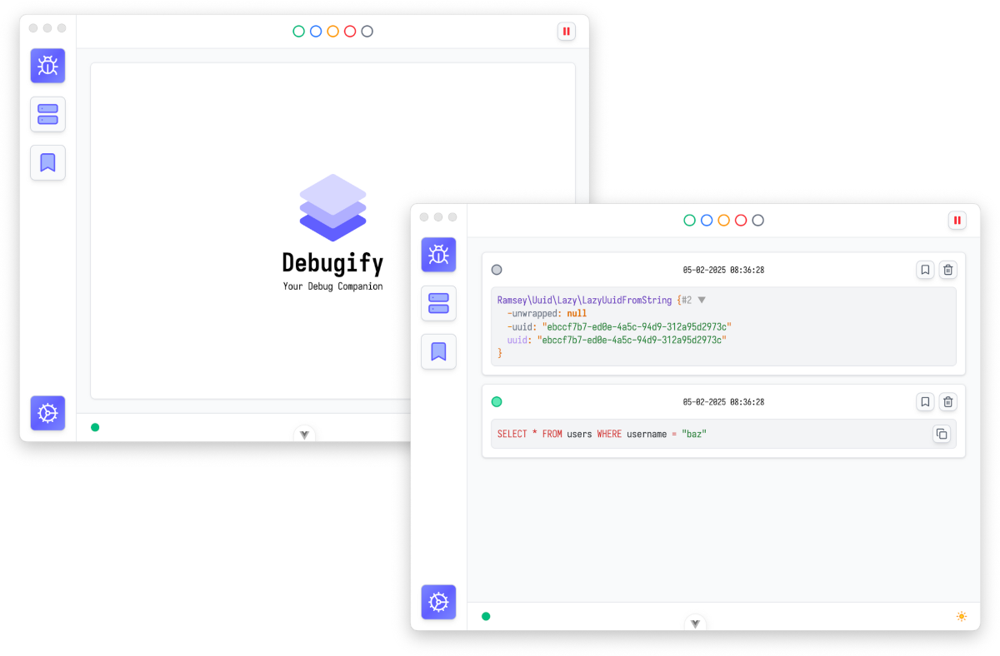

<p align="center">
    
</p>

<p align="center">
    
    
    
</p>

## Debugify

This package is used to send messages to [Debugify App](https://debugify.octopy.dev) and can be installed in all PHP apps.

## Installation

```bash
composer require octopyid/debugify --dev
```

## Usage

```php
dfy('foo', 'bar', 'baz');
```

By default, messages will be grouped into the `Grey` color group, but you can group your messages into 4 different color: `Green`, `Blue`, `Yellow` and `Red`.

```php
dfy('SELECT * FROM users WHERE username = "baz"')->color('green');
```

## Configuration

If you use a different host and port, you can set it in the following way in top of your application:

```php
dfy()->configure(function (\Octopy\Debugify\Config $config){
    $config->host('127.0.0.1')->port(1234);
});
```

## Security

If you discover any security related issues, please email [bug@octopy.dev](mailto:bug@octopy.dev) instead of using the issue
tracker.

## Credits

- [Supian M](https://github.com/SupianIDz)
- [Octopy ID](https://github.com/OctopyID)

## License

The MIT License (MIT). Please see [License File](LICENSE) for more information.
